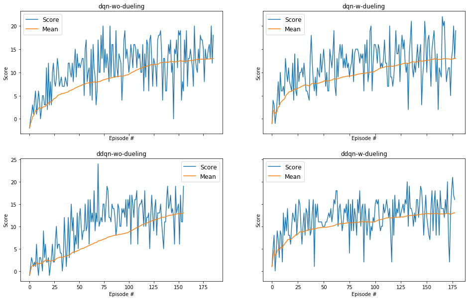

[//]: # (Image References)

[image1]: https://user-images.githubusercontent.com/10624937/42135619-d90f2f28-7d12-11e8-8823-82b970a54d7e.gif "Trained Agent"

# Project 1: Navigation
### Author: Hafizur Rahman

For this project, an agent was trained to navigate (and collect bananas!) in a large, square world.

![Trained Agent][image1]

## Learning Algorithm
The project implemented [Deep Q-Learning](https://storage.googleapis.com/deepmind-media/dqn/DQNNaturePaper.pdf) algorithm, a value-based Reinforcement Learning algorithm which surpassed human-level performance in Atari games.

### Hyperparameters

| Hyperparameter                      | Value     |
|-------------------------------------|:---------:|
| Replay buffer size	              | 10000     |
| Batch size	                      | 64        |
| gamma (discount factor)	          | 0.99      |
| tau                                 | 1e-2      |
| Learning rate	                      | 4.8e-4    |
| update interval	                  | 4         |
| Number of episodes	              | 500       |
| Max number of timesteps per episode |	300       |
| Epsilon start	                      | 0.1       |
| Epsilon minimum	                  | 0.10      |
| Epsilon decay	                      | 0.985     |

## Plot of Rewards
| Network         | # Episode to solve |
|-----------------|:------------------:|
| dqn-wo-dueling  |  85                |
| dqn-w-dueling   |  78                |
| ddqn-wo-dueling |  55                |
| ddqn-w-dueling  |  77                |

The best performance was achieved by `DDQN` with `Dueling` network, scored 13+ in 55 episodes.

Hyperparameter tuning for `learning rate` and `eps` helped to improve the performance.

## Ideas for Future Work
* [Prioritized experience replay](https://arxiv.org/abs/1511.05952) in Deep Q-Networks (DQN) achieved human-level performance across many Atari games, so it was tried to explore. However, it didn't give expected performance. Probably it needs to make more effort on parameter tuning.
* Other improvements like [multi-step bootstrap targets](https://arxiv.org/abs/1602.01783), [Distributional DQN](https://arxiv.org/abs/1707.06887), [Noisy DQN](https://arxiv.org/abs/1706.10295) might be benefical as well
